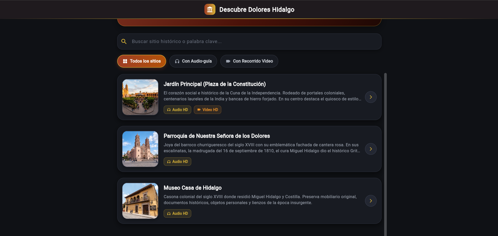
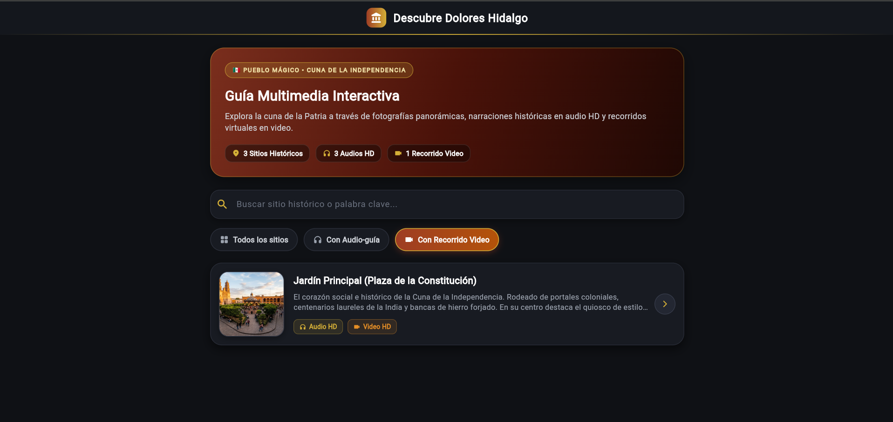
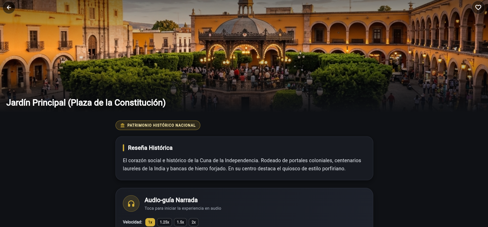
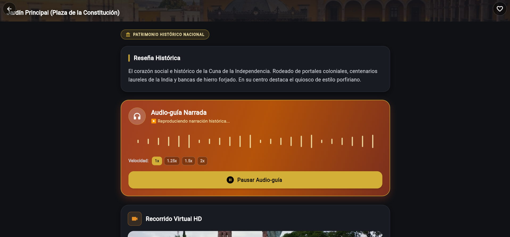
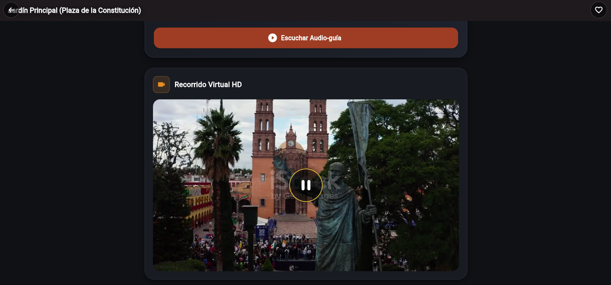
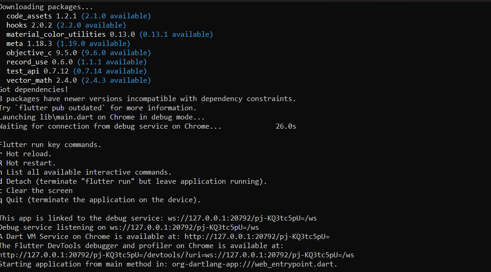
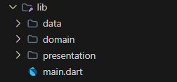

# 🇲🇽 Descubre Dolores Hidalgo - Guía Turística Multimedia

Aplicación móvil y web interactiva construida con **Flutter** aplicando los principios de **Clean Architecture** (Arquitectura Limpia) y el patrón de diseño **MVVM** (Model-View-ViewModel).

---

## 📌 Evidencias de Ejecución y Prácticas

### 1. 📱 Pantalla Principal - Lista de Sitios Históricos
Vista panorámica de la guía multimedia con la lista de lugares emblemáticos de la Cuna de la Independencia.



---

### 2. 🔍 Búsqueda y Filtrado Dinámico
Demostración de la barra de búsqueda por palabras clave y filtrado de sitios por disponibilidad de **Audio-guía** o **Recorrido en Video**.



---

### 3. 🏛️ Pantalla de Detalle de Sitio Histórico
Vista detallada con fotografía panorámica HD, distintivo de Patrimonio Histórico Nacional y reseña histórica completa.



---

### 4. 🎧 Reproducción de Audio-guía Narrada
Funcionamiento del reproductor de audioguía con ecualizador de ondas sonoras en vivo y selector de velocidad de reproducción en tiempo real (`1.0x`, `1.25x`, `1.5x`, `2.0x`).



---

### 5. 🎬 Recorrido Virtual en Video HD
Reproducción fluida del recorrido virtual en video (`.mp4`) dentro del widget interactivo de `video_player`.



---

### 6. 🧪 Pruebas Unitarias TDD (`flutter test`)
Ejecución en verde de las pruebas unitarias automatizadas sobre la Capa de Dominio utilizando un repositorio simulado (*Fake*).



```bash
flutter test
# Output: 00:01 +1: All tests passed!
```

---

### 7. 📁 Estructura del Proyecto (Clean Architecture)
Evidencia de la separación estricta en 3 capas desacopladas (**Domain**, **Data** y **Presentation**).



---

## ✅ Checklist de Verificación (Clean Architecture)

- [x] **Dominio Aislado**: Ningún archivo dentro de `domain/` importa `package:flutter/material.dart`.
- [x] **Regla de Dependencia**: Las entidades del Dominio son puras y no dependen de la capa de Datos ni de la UI.
- [x] **Casos de Uso Únicos**: Cada clase en `usecases/` ejecuta una sola acción de negocio (`call()`).
- [x] **Inyección por Constructor**: Los ViewModels reciben los casos de uso por su constructor.
- [x] **Raíz de Composición**: `main.dart` es el único archivo donde se instancian y conectan las clases concretas de las 3 capas.
- [x] **Pruebas TDD**: Existe al menos una prueba unitaria del Dominio (`test/obtener_lugares_test.dart`) probada con un *Fake*.
- [x] **Gestión de Recursos**: Todos los controladores multimedia de audio y video liberan memoria mediante `dispose()`.

---

## 🛠️ Tecnologías y Paquetes

* **Framework:** [Flutter 3.x](https://flutter.dev/) (Dart 3)
* **Audio Player:** [`audioplayers`](https://pub.dev/packages/audioplayers)
* **Video Player:** [`video_player`](https://pub.dev/packages/video_player)
* **Testing:** `flutter_test`
